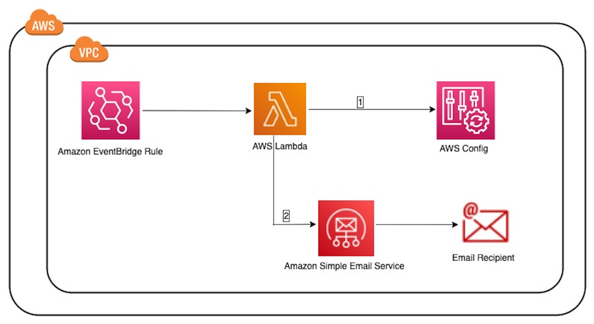

# Automated AWS Config reporting for resources that have been non compliant for a period of time.

Use AWS Config to evaluate the configuration settings of your AWS resources. You do this by creating AWS Config rules, which represent your ideal configuration settings. AWS Config provides customizable, predefined rules called managed rules to help you get started. While AWS Config continuously tracks the configuration changes that occur among your resources, it checks whether these changes violate any of the conditions in your rules. If a resource violates a rule, AWS Config flags the resource and the rule as noncompliant.

This solution includes a serverless architecture for running a query against AWS Config.  [Amazon EventBridge Rule](https://docs.aws.amazon.com/eventbridge/latest/userguide/eb-rules.html) triggers an [AWS Lambda](https://aws.amazon.com/lambda/) function on the day and time of your choice to find the list of non-compliant resources from non compliant rules which are not remediated over a period of 30 days. 

The following figure provides the architecture for this end-to-end flow within the solution:




Detailed instructions can be found here: <Link to blog>

### Prerequisites

Before getting started, make sure that you have a basic understating of the following:
* [Amazon EventBridge rule that runs on a schedule](https://docs.aws.amazon.com/eventbridge/latest/userguide/eb-create-rule-schedule.html)
* [Multi-Account Multi-Region Data Aggregation](https://docs.aws.amazon.com/config/latest/developerguide/aggregate-data.html)
* [AWS Lambda Function](https://docs.aws.amazon.com/lambda/latest/dg/welcome.html)
* Python and [Boto3](https://boto3.amazonaws.com/v1/documentation/api/latest/index.html).
* [CDK environments](https://docs.aws.amazon.com/cdk/v2/guide/environments.html).  

You will also need to have a pre-configured [Multi-Account AWS Config Aggregator](https://docs.aws.amazon.com/config/latest/developerguide/setup-aggregator-console.html) and [Amazon SES](https://docs.aws.amazon.com/ses/latest/dg/setting-up.html) for sending email.

A pre-configured [AWS Config Aggregator](https://docs.aws.amazon.com/config/latest/developerguide/setup-aggregator-console.html).
A pre-configured [Amazon SES](https://docs.aws.amazon.com/ses/latest/dg/setting-up.html).


### Architecture
1. Amazon EventBridge rule - triggers an AWS Lambda function on a specific configurable day and time.
2. AWS Lambda - will run API against AWS Config, creates a CSV file with details and sends email using SES.
3. AWS Config aggregator - collects AWS Config configuration and compliance data.
4. Amazon Simple Email Service - will be used to send an email with the CSV file created by Lambda function.


### Getting Started

1. ```git clone https://github.com/aws-samples/Config-report```
2. ```cd Config-Report/config_report```
3. ```cdk bootstrap```
4. ```cdk deploy ConfigReport --parameters Aggregator=<aggregator name> --parameters Recipient=<recipient email address> --parameters Sender=<sender email address> --parameters Weekday=<Day-of-week 1-7 or SUN-SAT> --parameters Hour=<time in UTC (hour)> --parameters Minute=<time in UTC (minute)> --parameters SESarn=<ses arn>```  
    
    Replace the parameters as follows:
    * Aggregator - Name of AWS Config Aggregator.
    * Recipient - Email recipient that will get the csv report.
    * Sender - Email sender as configured on SES.
    * Weekday - Day-of-week 1-7 or SUN-SAT Lambda will run. 
    * Hour - The hour (UTC) the Lambda will run.
    * Minute - The minute (UTC) the Lambda will run.
    * SESarn - The preconfigured SES arn.

5. The deployment will generate a report.
6. Check your recipient email inbox.


## Security
See [CONTRIBUTING](CONTRIBUTING.md#security-issue-notifications) for more information.

## License
This library is licensed under the MIT-0 License. See the LICENSE file.